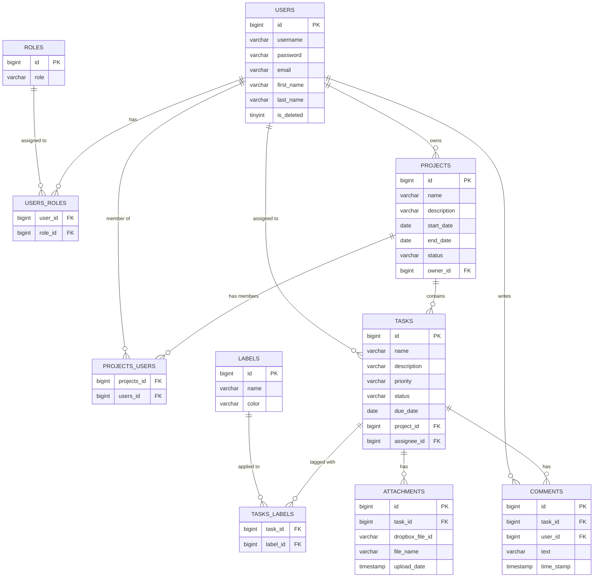

# Task Management System

A Spring Boot–based REST API for managing tasks, projects, and team collaboration. The system allows users to create
projects, assign and track tasks, organize work with labels, discuss progress via comments, and attach files to tasks —
with JWT-based authentication and role-based access control.

## Key Features

- **Project management** — create projects, add/remove members, track status and filter by name/status/date range.
- **Task management** — assign tasks within a project, set priority and due date, tag tasks with labels, and search
  tasks by status, priority, due date, or label.
- **Access control** — project owners have full control; project members can view and interact; outsiders are denied.
- **Comments & Attachments** — discuss tasks via comments and attach files, stored remotely via Dropbox.
- **Notifications** — task assignment triggers an async email notification.
- **Authentication** — JWT-based login/registration with BCrypt password hashing and Spring Security role checks.
- **API documentation** — interactive Swagger UI via springdoc-openapi.

## Tech Stack

| Category                            | Technology                            | Version                       |
|-------------------------------------|---------------------------------------|-------------------------------|
| Language                            | Java                                  | 22                            |
| Framework                           | Spring Boot                           | 4.0.3                         |
| Web                                 | Spring Web (Spring MVC)               | Managed by Spring Boot        |
| Persistence                         | Spring Data JPA / Hibernate           | Managed by Spring Boot        |
| Security                            | Spring Security                       | Managed by Spring Boot        |
| Validation                          | Spring Boot Starter Validation        | Managed by Spring Boot        |
| Database                            | MySQL                                 | Managed by Spring Boot        |
| Migrations                          | Liquibase                             | Managed by Spring Boot        |
| Object Mapping                      | MapStruct                             | 1.6.3                         |
| Object Mapping (annotation binding) | lombok-mapstruct-binding              | 0.2.0                         |
| Boilerplate reduction               | Lombok                                | Managed by Spring Boot        |
| Authentication                      | JJWT                                  | 0.12.6                        |
| API Documentation                   | springdoc-openapi-starter-webmvc-ui   | 2.8.8                         |
| File Storage                        | Dropbox Core SDK                      | 8.0.2                         |
| Email                               | Spring Boot Starter Mail (Gmail SMTP) | Managed by Spring Boot        |
| Testing                             | JUnit 5 / Spring Boot Starter Test    | Managed by Spring Boot        |
| Integration Testing                 | Testcontainers (MySQL module)         | 2.0.3                         |
| Security Testing                    | spring-security-test                  | Managed by Spring Boot        |
| Build Tool                          | Maven                                 | 3.9.12                        |
| Containerization                    | Docker / Docker Compose               | Managed by Spring Boot        |
| Static Analysis                     | Checkstyle (Google Java Style)        | maven-checkstyle-plugin 3.3.0 |

## Setup and Installation

### Prerequisites

Before you begin, ensure you have the following installed on your machine:

* **JDK 22**
* **Maven**
* **Docker and Docker Compose**
* **A Dropbox Account**
* **A Google Account**

### Step 1: Clone the Repository

```bash 
git clone https://github.com/gubber230/task-management-system.git

cd task-management-system 
```

### Step 2: Configure Environment Variables

Create a file named `.env` in the root directory of the project and populate it with your specific configurations. Here
is a template based on the required application properties:

```env
# Database Configuration
MYSQLDB_USER=user 
MYSQLDB_DATABASE=db 
MYSQLDB_PASSWORD=password 
MYSQLDB_ROOT_PASSWORD=root_password
MYSQLDB_LOCAL_PORT=3307 
MYSQLDB_DOCKER_PORT=3306

# Spring Boot Application Configuration
SPRING_LOCAL_PORT=8080 
SPRING_DOCKER_PORT=8080
DEBUG_PORT=5005

# JWT Authentication
JWT_SECRET=secret_key
 JWT_EXPIRATION=300000 # Time in milliseconds

# Dropbox API
DROPBOX_ACCESS_TOKEN=your_dropbox_generated_access_token

# Gmail SMTP
GMAIL_USERNAME=your_email@gmail.com 
GMAIL_APP_PASSWORD=your_16_character_gmail_app_password 
```

### Step 3: Build the Application

Use Maven to compile the code and build the executable JAR file:

```bash
 mvn clean package
  ```

### Step 4: Run with Docker Compose

The project uses Docker Compose to easily spin up the application and the MySQL database container. Run the following
command in the root directory:

```bash 
docker-compose up --build -d 
```

The `-d` flag runs the containers in detached mode.

### Step 5: Access the Application

Once the containers are successfully running, the API will be available at:
`http://localhost:SPRING_LOCAL_PORT`

**Swagger UI Documentation:**
You can interact with the API endpoints by navigating to:
`http://localhost:8080/swagger-ui/index.html`

---

## API Endpoints

### 1. Authentication Controller

Endpoints for managing users authentication

* **POST** `/auth/login` - Login user
* **POST** `/auth/registration` - Registered a new user
* **GET** `/auth` - Get all users

### 2. Project Controller

Endpoints for managing projects

* **POST** `/projects` - Create a project
* **GET** `/projects` - Get current user accessible projects
* **GET** `/projects/{id}` - Get user project by id
* **PATCH** `/projects/{id}` - Update projects name or description
* **DELETE** `/projects/{id}` - Delete user project
* **GET** `/projects/search` - Sort projects by parameters

### 3. Task Controller

Endpoints for managing tasks

* **POST** `/tasks` - Create a task
* **GET** `/tasks` - Get current user accessible tasks
* **GET** `/tasks/{id}` - Get task by id
* **PUT** `/tasks/{id}` - Update task
* **DELETE** `/tasks/{id}` - Delete task
* **GET** `/tasks/search` - Sort tasks by parameters

### 4. Comment Controller

Endpoints for managing comments

* **POST** `/comments` - Create a comment
* **GET** `/comments?taskId={taskId}` - Retrieve comments for a task

### 5. Label Controller

Endpoints for managing labels

* **POST** `/labels` - Create a new label
* **GET** `/labels` - Retrieve all labels
* **PUT** `/labels/{id}` - Update a label
* **DELETE** `/labels/{id}` - Delete a label

### 6. Attachment Controller

Endpoints for managing attachments

* **POST** `/attachments?taskId={taskId}` - Upload an attachment to a task
* **GET** `/attachments?taskId={taskId}` - Download attachments for a task
* **DELETE** `/attachments?taskId={taskId}` - Delete an attachment from a task

## Entity Relationship Diagram


